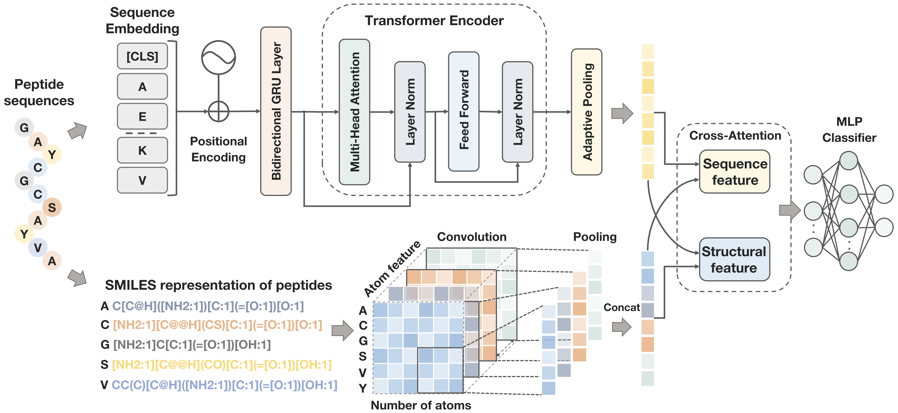

# 蛋白质修饰预测工具

基于深度学习的蛋白质修饰预测工具，输入蛋白质序列，输出该序列是否经过修饰的预测结果。

## 模型架构

本工具采用双模态融合框架：
- **序列特征提取**: BiGRU + Transformer 捕获序列的局部和全局依赖关系
- **结构特征提取**: 多尺度CNN从分子图中提取原子级结构特征
- **特征融合**: 交叉注意力机制对齐并融合两种特征模态



## 数据集

数据集位于 [Dataset](./Dataset) 文件夹：
- `train_pos.fasta` - 训练集正样本（已修饰）
- `train_neg.fasta` - 训练集负样本（未修饰）
- `test_pos.fasta` - 测试集正样本
- `test_neg.fasta` - 测试集负样本

## 安装说明

1. **克隆仓库**
```bash
git clone <repository-url>
cd ToxiPep
```

2. **创建Python环境**
```bash
conda create -n protein_mod python=3.10
conda activate protein_mod
pip install -r requirements.txt
```

## 使用方法

### 训练模型

```bash
cd Code
python main.py
```

训练完成后，最佳模型将保存为 `best_model.pth`。

### 预测

对新的蛋白质序列进行修饰预测：

```bash
cd Code
python predict.py -i input.fasta -o output.txt
```

**参数说明：**
- `-i`: 输入FASTA文件路径
- `-o`: 输出结果文件路径
- `-m`: 模型文件路径（可选，默认：`best_model.pth`）

**输入文件格式（FASTA）：**
```
>seq1
AMGMGQEDVSALREVGKLLAFLKEPEPPKGFRD
>seq2
EYVNPEDVPADVVAKEKEVQVEIAMNEGKPAEI
```

**输出文件格式：**
```
序列	预测结果	置信度
AMGMGQEDVSALREVGKLLAFLKEPEPPKGFRD	已修饰	0.923456
EYVNPEDVPADVVAKEKEVQVEIAMNEGKPAEI	未修饰	0.876543
```

## 项目结构

```
ToxiPep/
├── Code/
│   ├── main.py          # 训练脚本
│   ├── predict.py       # 预测脚本
│   ├── model.py         # 模型定义
│   ├── dataset.py       # 数据加载
│   ├── atom_feature.py  # 原子特征提取
│   └── best_model.pth   # 训练好的模型
├── Dataset/
│   ├── train_pos.fasta  # 训练正样本
│   ├── train_neg.fasta  # 训练负样本
│   ├── test_pos.fasta   # 测试正样本
│   └── test_neg.fasta   # 测试负样本
├── requirements.txt
└── README.md
```

## 联系方式

如有任何问题，请联系：

Jiahui Guan  
📧 jhguan@connect.hku.hk
